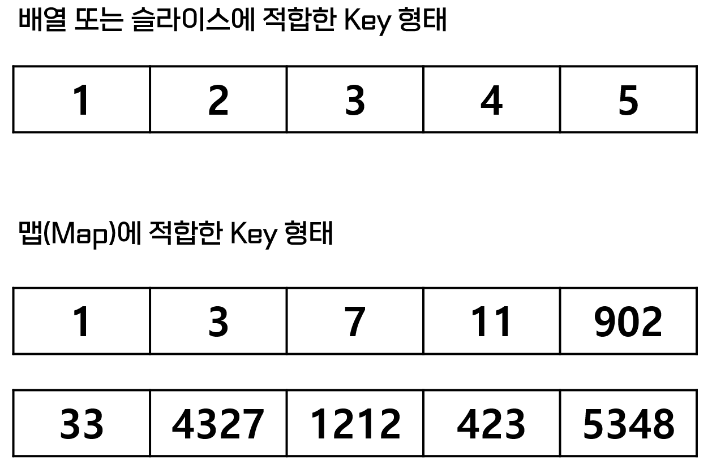
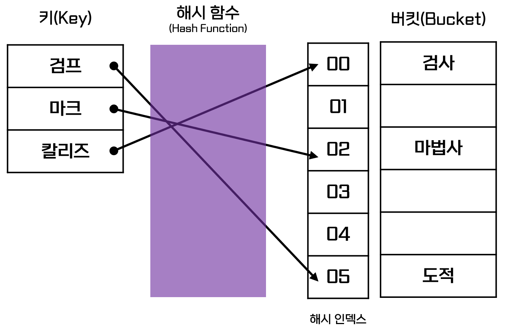
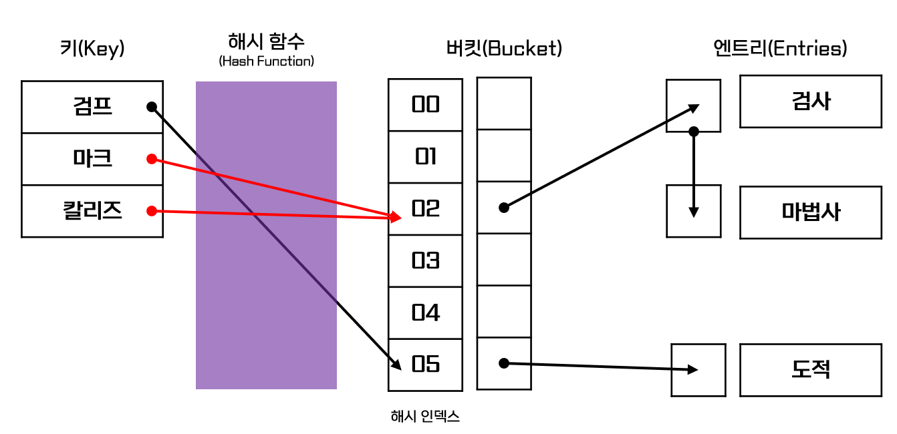

# 맵

배열과 슬라이스는 **인덱스로 정수만 사용할 수 있는 한계점이 존재**합니다. 하지만 현실 데이터를 가상의 영역으로 구현하기 위해서는 **인덱스 값이 정수가 아닌 문자열 또는 형태로 표현될 필요성**이 있습니다.

이를 해결하기 위해서 Go 언어에서는 `맵(Map)`을 지원하고 있습니다.

해당 파트에서는 `맵(Map)` 자료 구조의 형태 분석 장·단점, Go에서의 사용 방법 및 활용방안 등에 대해서 소개합니다.

## 개요

`맵(Map)`은 앞서 말한 것 처럼 인덱스가 정수가 아닌 `키(Key)`-`값(Value)`의 쌍으로 이루어져 있는 구조입니다. 그렇기에 사용할 때에는 되도록이면 **`키(Key)`의 값이 양의 정수가 아닌 값**이어야하며, 양의 정수로 구성되어도 **순차적으로 증가하는 형태가 아니거나 범위가 넓은 형태일 경우 사용**되어야 합니다.

<figure><figcaption><p>키(Key) 구성  형태의 비교</p></figcaption></figure>


또한 bool 변수와 같이 상태 표현이 짧은 `키(Key)`이거나 부동 소수점 값과 같이 정밀도를 높이기 위해 구성이 복잡한 경우 버그나 충돌이 발생할 수 있음으로 `키(Key)`로 사용하지 않는 것이 좋다.


### 장·단점

공부를 하며 봤던 책에서는 장점만 기술하여 사실 크게 신뢰가 되지 않아 장점과 함께 단점 또한 확인해보았다.

#### **장점**

1. 무조건은 아니지만 Go에서 작성 된 대부분의 경우에 성능이 좋음
2. 맵의 원소에  $$O(n)$$ (선형 시간)으로 접근이 가능하다
3. 원소를 추가하거나 검색할 때 맵의 크기에 따라 성능이 급격하게 하락하거나 하지않는다.
4. 맵의 형식이 쉽기 때문에 설계가 명확해지고 복잡도를 낮출 수 있다.

#### **단**점

1. 키(Key)에 대한 순서가 보장되지 않음
2. 높은 메모리 사용량

위와 같은 장·단점을 비교하면서 Go 언어에서 사용되는 `맵(Map)`은 어떤 방식으로 구현 되어 있기에 이러한 장·단점을 가지게 되었는지 궁금하여 직접 코드를 확인해보았다.\[1]


Go 언어의 맵(Map) 타입 소스 코드


위 소스코드를 분석하면, Go 언어에서의 `맵(Map)`은 `해시 테이블(Hash Table)` 자료 구조를 기반으로 하여 제작 되었음을 알 수 있다.&#x20;


`해시 테이블(Hash Table)`은 `키(Key)`-`값(Value)`  쌍으로 이루어져 있는 자료구조로 내부적으로 `배열(버킷, Bucket)`을 사용하여 데이터를 저장한다. 그렇기에 각 `키(Key)` 값에 대한 고유 인덱스를 생성하고 이를 활용해 `값(Value)`를 $$O(1)$$속도로저장, 검색할 수 있게 된다.


<figure><figcaption><p>해시 테이블(Hash Table)의 저장 구조</p></figcaption></figure>

하지만 `해시 테이블(Hash Table)`또한 장점이 있으니 단점이 있다. 그것은 바로 해시 함수의 오류로 인한 해시 인덱스 값의 충돌이 발생할 수 있다는 것이다.

이러한 해시 충돌은 2가지 알고리즘 중 하나를 선택해 적용하게 되는데 Go언어의 `맵(Map)`에서는 `분리 연결법(Separate Chaining)` 방식을 채택해 사용하고 있다. (이후 변경될 수 있음  1.21 기준)

<figure><figcaption><p>분리 연결법(Separate Chaining) 방식의 구조</p></figcaption></figure>

하지만 `분리 연결법(Separate Chaining)` 방식은 위 도식에서 볼 수 있듯이 별도의 `엔트리(Entries)`를 구성하기 때문에 **충돌이 많이 발생할 수록 데이터를 저장 해야하는 공간이 많이 필요**해지고 충돌 된 곳의 키를 찾기 위해서 `최악의 경우` $$O(n)$$`만큼 탐색` 해야하기 때문에 Go 언어에서는 공식적으로 $$O(1)$$이 아닌 $$O(n)$$의 시간이 걸린다고 이야기하고 있는 것 같다.

참고로 보통 엔트리를 구성할 때 연결 리스트 구조를 많이 사용하는데 Go 언어에서는 `배열(Array)` 형태로 구성되어 있다.

Go 언어에서 연결 리스트 구조를 사용하지 않은 것은 포인터 연산 및 비트 연산 작업이 Go 언어에서 지원함으로 미리 할당해둔 배열 `공간(슬롯, Slot)`을 찾아 값을 넣기만 하면 할당 되기 때문이라고 한다.\[2]

### 사용 방법

#### 맵(Map)의 변수 선언 및 할당

`맵(Map)`은 아래와 같은 방식으로 선언이가능하다.&#x20;

```go
// 일반 변수 선언
var exampleMap map[int]string // int 키, string 값을 가진 Map 선언
```

처음 `맵(Map)`을 할당하게 되면 `nil 값`을 가지고 있으며, 이를 `Nil Map`이라고 부른다. `Nil Map`은 **초기화를 통해 원하는 형태의 데이터를 할당**할 수 있다.

초기화 방식에는 `make()` 함수를 통한 방식과 `리터럴(literal)`을 통한 방식이 있다.

```go
// make() 함수를 통한 초기화
characterMap = make(map[int]string)

// 리터럴(literal)을 통한 초기화
characterMap := map[int]string{
    0: "초보자",
    100: "전사",
    101: "파이터",
    102: "스피어맨",
    200: "마법사",
    300: "도적",    // 마지막 까지 모두 , 를 붙여야 오류가 나지 않음
}
```

참고로 `맵(Map)`을 사용할 때에 `리터럴(literal)`을 통해 초기화를 하면 높은 성능을 낼 수 있다고 한다.  왜냐하면 Go 언어에서는 `SSA(Static Single-Assignment, 정적 단일 할당 방식)`을 채택하여 위와 같은 형태로 표시하면 컴파일러가 추가 단계 없이 할당할 수 있기 때문이다.\[3]

> [_Don't anthropomorphize computers. They hate that!_](https://www.goodreads.com/quotes/8696204-don-t-anthropomorphize-computers-they-hate-it) _- Andrew McAfee_\
> _(컴퓨터를 의인화하지 마세요. 그들은 그걸 정말 싫어한답니다!, Andrew McAfee)_

#### 맵(Map)의  활용

* `맵(Map)`의 길이는 배열과 슬라이스처럼 `len()` 함수를 통해서 확인 가능함

```go
package main

import "fmt"

func main() {
	// 리터럴(literal)을 통한 초기화
	characterMap := map[int]string{
		0:   "초보자",
		100: "전사",
		101: "파이터",
		102: "스피어맨",
		200: "마법사",
		300: "도적", // 마지막 까지 모두 , 를 붙여야 오류가 나지 않음
	}

	fmt.Println(len(characterMap))
}
```

```
// 결과 값
6
```

* `delete()` 함수를 이용해 맵의 특정 키(Key)-값(Value) 쌍을 제거할 수 있음

```go
package main

import "fmt"

func main() {
	// 리터럴(literal)을 통한 초기화
	characterMap := map[int]string{
		0:   "초보자",
		100: "전사",
		101: "파이터",
		102: "스피어맨",
		200: "마법사",
		300: "도적", // 마지막 까지 모두 , 를 붙여야 오류가 나지 않음
	}

	fmt.Println(characterMap)

	delete(characterMap, 100)

	fmt.Println(characterMap)
}
```

```
// 결과 값
map[0:초보자 100:전사 101:파이터 102:스피어맨 200:마법사 300:도적]
map[0:초보자 101:파이터 102:스피어맨 200:마법사 300:도적]
```

* 키 존재 여부를 쉽게 확인할 수 있음

```go
// 키(Key) 존재 여부 확인 예시 코드
package main

import "fmt"

func main() {
	aMap := map[string]int{
		"key1": -1,
		"key2": 123,
	}

	v, ok := aMap["key3"]

	fmt.Println("v: ", v)
	fmt.Println("ok:", ok)
}
```

```go
// 정상 키(Key)의 출력 결과
v: -1
ok: true

// 잘못 된 키(Key)의 출력 결과 
v: 0
ok: false
```


잘못 된 `키(Key)`를 호출 했을 때의 경우 v에 할당 되는 값은 해당 타입의 `초기값(Zero Value)`이며, nil 체크를 통해서 `맵(Map)`을 관리하는 것이 바람직한 방식이다.


## 참고 자료

\[1] "map.go source file", [https://go.dev/src/runtime/map.go](https://go.dev/src/runtime/map.go)

\[2] "Go에서 해시 테이블(Map)은 어떻게 구현되어 있을까?", _Myung-Hyun Kim_, [https://blog.frec.kr/golang/go-hashtable-0](https://blog.frec.kr/golang/go-hashtable-0/), 2022. 04. 07.

\[3] "Golang - Performance difference between literals and constants", _torek_, [https://stackoverflow.com/questions/63545584/golang-performance-difference-between-literals-and-constants](https://stackoverflow.com/questions/63545584/golang-performance-difference-between-literals-and-constants), 2020. 08. 23.
