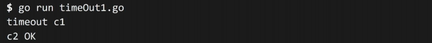

# 두 가지 CSV  파일 포맷 다루기


본 챕터는 '인터페이스'의  정의에 이어, 구체적인 예시로 아래 프로그램을 작성 하려고 합니다.

* 디스크에 CSV 파일로 저장된 테이블의 컬럼 구조를 인식하여, 인식 가능한 컬럼인지 확인하고 메모리에 로드 합니다.
* 메모리에 로드한 테이블을 'Name' 필드를 이용해 정렬 후 출력합니다.

이 프로그램을  통해 인터페이스를 활용하여 기능을 확장하는 과정을 공유하고, 편리함에 대해 공유 해 보려고 합니다.&#x20;


## 시뮬레이션

위에서 대략적인 요구 사항을 확인 했으면, 구체적인 프로그램으로 작성하는 과정을 거쳐야겠죠. 아래에서 대략적인 시나리오에 따라 요구사항이 왔다고 가정해보겠습니다.

1. 특정 포멧을 가진(이름, 성 전화번호, 마지막 접근 시간)  CSV 파일을 읽고 정렬하여 콘솔에 프로그램을 출력하는 프로그램을 제작 해 달라는 요청
2. &#x20;다른 포멧(이름, 성, 지역코드, 전화번호, 마지막 접근 시간) 도 읽을 수 있도록 추가해달라는 요청

## 프로그램 작성


### 1차

그럼  특정 포멧을 가진(이름, 성 전화번호, 마지막 접근 시간)  CSV 파일을 읽고 정렬하여 콘솔에 프로그램을 출력하는 프로그램을 제작 해 보겠습니다.

#### 시퀸스 다이어그램

<figure><figcaption></figcaption></figure>


#### 기능 구현


먼저 아래와 같이 읽을 포멧을 만들고, 이를 정렬, 출력하는 기능을 추가 하였습니다.

```go
type Figure01 struct {
...
}

type Figure01s []Figure01
...


func (fs Figure01s) Sort() {
	sort.Sort(fs)
}

func (fs Figure01s) PrintConsole() {
	for i, f := range fs {
		fmt.Printf("%d : %s, %s, %s, %s\n", i, f.Name, f.Surname, f.Tel, f.LastAccess)
	}
}
```


CSV Reader가 파일을 읽어서, 직접적으로 reader.Figure01s 을 반환하도록 한 후

<pre class="language-go"><code class="lang-go"><strong>func (c *CsvReader) ReadFile(path string) (reader.Figure01s, error) {
</strong>    ...
}
</code></pre>


정렬후, 출력을 하는 프로그램을 만들었습니다.

```go
func main() {
    readAndSort("./.resource/figure01.csv")
    readAndSort("./.resource/figure02.csv")
    readAndSort("./.resource/figureX.csv")
}

func readAndSort(path string) {
    csvReader := NewCsvReader()

    f, err := csvReader.ReadFile(path)
    if err != nil {
       fmt.Println(err)
       return
    }

    f.Sort()
    f.PrintConsole()
}
```


출력이 완료되었습니다. 첫번째 포멧을 출력하는 프로그램을 제작 하게 되었습니다!

<pre><code><strong>// ./.resource/figure01.csv
</strong><strong>0 : A, John, 01044444444, 2019-01-01 00:00:00
</strong>1 : B, John, 01033333333, 2019-01-01 00:00:00
2 : C, John, 01022222222, 2019-01-01 00:00:00
3 : D, John, 01011111111, 2019-01-01 00:00:00
// ./.resource/figure02.csv
not implemented
// ./.resource/figureX.csv
not implemented
</code></pre>


### 2차


이번에는다른 포멧(이름, 성, 지역코드, 전화번호, 마지막 접근 시간) 도 읽을 수 있도록 추가해 보겠습니다.


아래와 같이 동일한 구조체를 만들었는데...&#x20;

```go
type Figure01 struct {
...
}

type Figure01s []Figure01

...

func (fs Figure01s) Sort() {
    sort.Sort(fs)
}

func (fs Figure01s) PrintConsole() {
    for i, f := range fs {
       fmt.Printf("%d : %s, %s, %s, %s\n", i, f.Name, f.Surname, f.Tel, f.LastAccess)
    }
}

type Figure02 struct {
...
}

type Figure02s []Figure02

...

func (fs Figure02s) Sort() {
	sort.Sort(fs)
}

func (fs Figure02s) PrintConsole() {
	for i, f := range fs {
		fmt.Printf("%d : %s, %s, %s, %s, %s\n", i, f.Name, f.Surname, f.Areacode, f.Tel, f.LastAccess)
	}
}
```


이를 지원하기위해서 두개의  CSV 리더를 만들면... 중복 코드가 생기게 되겠죠

<pre class="language-go"><code class="lang-go"><strong>func (c *CsvReader) ReadFile(path string) (reader.Figure01s, error) {
</strong>    ...
}
</code></pre>

<pre class="language-go"><code class="lang-go"><strong>func (c *CsvReader) ReadFile(path string) (reader.Figure02s, error) {
</strong>    ...
}
</code></pre>

이를아래와 같이 공통 인터페이스를 만들고, 이를 함수의 리턴값으로 설정하면

```go
package reader

type ControllableFile interface {
    Sort()
    PrintConsole()
}
```

```go
func (c *CsvReader) ReadFile(path string) (reader.ControllableFile, error) {
    ...
}
```


아래와 같이 다른 구조체에서 정렬, 출력 기능을 사용할 수 있게 됩니다.&#x20;

```go
func main() {
    readAndSort("./.resource/figure01.csv")
    readAndSort("./.resource/figure02.csv")
    readAndSort("./.resource/figureX.csv")
}

func readAndSort(path string) {
    csvReader := NewCsvReader()

    f, err := csvReader.ReadFile(path)
    if err != nil {
       fmt.Println(err)
       return
    }

    f.Sort()
    f.PrintConsole()
}
```


위와 같이, 인터페이스를 활용하면  유사한 기능을 쉽게 확장할 수 있게 됩니다.

##

## 소스코드


[https://github.com/MarkYoo23/mastering-go-example/](https://github.com/MarkYoo23/mastering-go-example/tree/master/2024-01-20%20two-csv-format)


## 팁

<figure><figcaption></figcaption></figure>

* intellij 에서 ctrl + enter 시 위의 사진과 같이 Implement interface 를 이용하여, 인터페이스를 구현할  수 있습니다.

